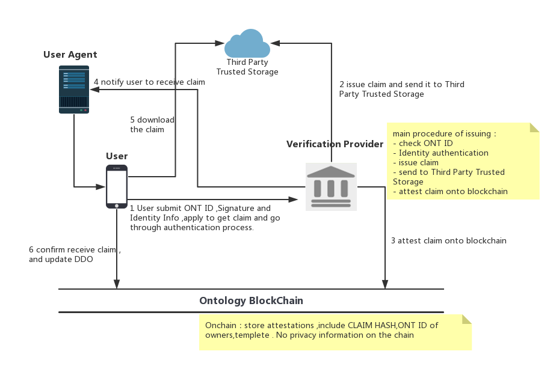

English / [中文](../cn/verification_provider_specification_cn.md)


<h1 align="center">The Access Standard for Trust Anchor</h1>
<p align="center" class="version">Version 0.7.0 </p>

## Introduction

Trust Anchor refers to the partner that provides authentication services on the Ontology ecosystem. It may be government agencies, universities, banks, third-party authentication service agencies (such as CA agencies), biometric technology companies, etc. They provide multi-dimensional authentication for the owner of the ONT ID and record the HASH of authentication behavior and authentication result through the Ontology blockchain at the first time, thereby providing a standardized and credible authentication method for the user authentication requester.

## Interactive Process Description

According to demands, there are two specific interaction processes.

* Online Application - Automatic Issuance Mode

    This mode means that users can initiate the real-time authentication through the client (such as Ontology official ONTO client), and immediately obtain the verifiable claim after the authentication passes. For example, Face++ follows this process.




* Offline Issuance Mode
    This model means that the Trust Anchor authenticates users through offline or other channels and issues a verifiable claim.

## Major Terms of Service

* Trust Anchor is not allowed to store any user data without related qualifications or user permission.
* Trust Anchor should announce on the official website that it is the provider of Ontology identification and verification service and specify the registered ONT ID.
* Trust Anchor should guarantee the accuracy and authenticity of its user information. The Ontology team is not responsible for the authenticity of the user information submitted by the Trust Anchor. The Ontology team does not take responsibilities for the invalidity of legal documents due to false or incomplete user information. The relevant responsibility should be taken by the Trust Anchor itself to its users or third parties.
* Trust Anchor should have the capability of identification and authentication management. The principle requirements are as follows. The target requirements can be specified by Party A according to the specific service requirements.
* Have the hardware and the network facilities for identification and authentication;
* Have safety protection standards;
* Deploy the software of identification and authentication management provided by Ontology open source standard code;
* Based on the management process of identification and authentication, the Trust Anchor should provide at least the following services of verifiable claim: 1. the issuance of a verifiable claim; 2. the revocation of a verifiable claim; 3. Providing open services of verifiable claim in official domain URL.


## Access Procedure


* **Register ONT ID**

    You need to register your ONT ID first. We recommend you to register it through the official SDK.

    [ont-java-sdk](https://github.com/ontio/ontology-java-sdk) - SDK to create a digital identity.

* **Integrated Features of Verifiable Claim Management**

    To achieve the issuance and management of the standard verifiable claim. To support the functions including issuing, revoking, verifying, querying, and publishing the templates of verifiable claim.
    
    We provide components to quickly integrate these features.

* **Customized Development**

    Step 1: Combine the existing identification methods, customize the A1 interface, and open it to the client;

    Step 2: Use SDK to implement the A2 interface for verifying user identity of ONT ID;

    [ont-java-sdk](https://github.com/ontio/ontology-java-sdk) - SDK to validate user signature.

    Step 3: Set templates of verifiable claim based on your business demand；
    
   Step 4: Use the A3 interface through the CWC. As shown in above figure, the A3 interface will help the Trust Anchor to issue and send it to the trusted storage and blockchain.

    > Note：Please use official domain name URL to open the API of verifying verifiable claim to the public.

    Typical examples of verifiable claim are as follows:
```
 {
        "Context":"claim:linkedin_authentication",
        "Id":"6KJKbctyin962nfdfvdf",
        "Content":{
            "Id": "yL5FdXB-um",
            "Name": "lifeng",
            "FirstName": "feng",
            "LastName": "li",
            "Bio": "Blockchain App Developer",
            "Avatar": "https://media.licdn.com/mpr/mprx/0_-HOmp1u9zNCxbF3iKoYjplm9clNP53AiyuoAplgLHN8Cs56_YaaCtAdIJ0qS66rf1IpK19_gajZa",
            "HomePage": "https://www.linkedin.com/in/%E4%BA%9A%E5%B3%B0-%E6%9D%8E-b56b8b79"
        },
        "Metadata":{
            "CreateTime":"2017-01-01T22:01:20Z",
            "Issuer":"did:ont:4XirzuHiNnTrwfjCMtBEJ6",
            "IssuerName":"onchain",
            "Subject":"did:ont:8uQhQMGzWxR8vw5P3UWH1j"
        },
        "Signature":{
            "Format":"pgp",
            "Algorithm":"ECDSAwithSHA256",
            "Value": ""
        }
    }     
```


## Reward and Dividend Mechanism

* As long as the user completes the authentication, the participating providers of authentication service will be rewarded, and the specific policies will be published on the “Ontology Governance White Paper.”

* As long as the user uses verifiable claim for identification, the participating providers of identification will be rewarded. The policies are formulated by decentralized data exchanges and Ontology.
